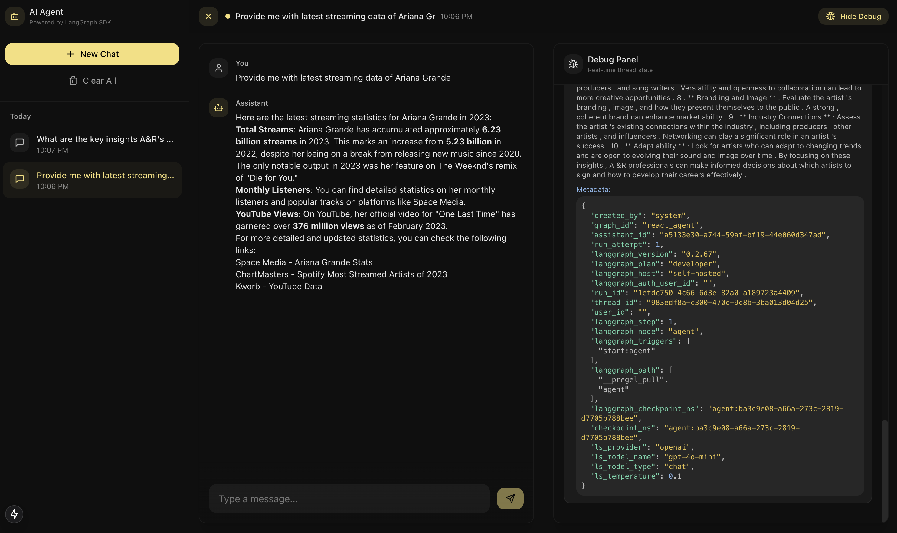
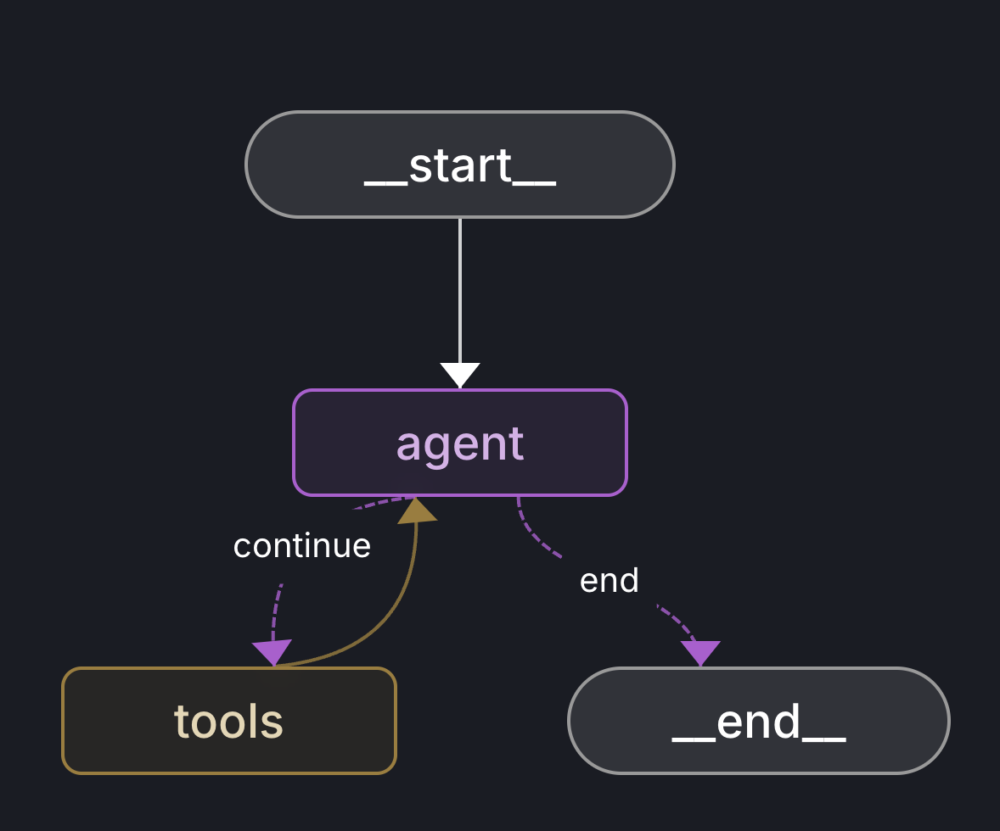

<div align="center">
<h1 align="center"> LangGraph + Next JS Starter Kit</h1>

[](https://www.python.org)
[](https://nextjs.org)
[](https://python.langchain.com/docs/langgraph)
[](https://python.langchain.com)

**A production-ready starter kit for building autonomous agents with LangGraph and Next.js**

[Documentation](https://python.langchain.com/docs/langgraph) | [LangGraph Client SDK](frontend/LangGraph%20Client%20JS%20SDK%20Main%20Draft.md) | [How-to Guides](https://langchain-ai.github.io/langgraph/how-tos/)

</div>

<div style="padding: 20px; border-radius: 8px; text-align: center;">
  
</div>

## 🎯 Overview

This starter kit provides a foundation for building autonomous agents using LangGraph and the LangGraph Client JS SDK. It serves as a practical implementation companion to the LangGraph Client JS SDK documentation (available both [locally](frontend/LangGraph%20Client%20JS%20SDK%20Main%20Draft.md), demonstrating how to build production-ready agent applications.

### What's Inside

- 🤖 **ReAct Agent Implementation**: A complete example of a ReAct agent using GPT-4o and Tavily search
- 🎨 **Next.js Frontend**: Modern UI with real-time agent interactions and streaming responses
- 🔌 **SDK Integration**: Production-ready examples of the LangGraph Client JS SDK
- 📦 **React Hooks & Contexts**: Ready-to-use hooks and contexts for agent state management

## 🧠 Key Concepts

### 1. Backend (Python with LangGraph)

The backend is a Python application (`backend/agent.py`) using LangGraph to define and run an "agent" that answers questions and uses search tools when needed. Key components:

- **Environment**: Uses virtual environment (venv) with dependencies in `requirements.txt`
- **Agent State**: Maintains conversation state using LangGraph's MemorySaver
- **Tools**: Includes TavilySearchResults for web searches
- **Model**: Uses ChatOpenAI (gpt-4o mini) with streaming enabled
- **System Prompt**: Provides high-level instructions to the AI about behavior and capabilities

### 2. LangGraph Request Flow

1. User message received through LangGraph Client SDK
2. Message enters "agent" node in StateGraph
3. GPT model processes message with system prompt
4. If needed, transitions to "tools" node for web searches
5. Returns to "agent" node for final response
6. Streams response back to frontend

<div style="padding: 20px; border-radius: 12px; text-align: left;">
  
</div>


### 3. Frontend (Next.js)

The frontend uses Next.js and React with several key components:

- **Contexts**: ChatContext (messages), ThreadContext (conversation sessions), ClientContext (LangGraph client)
- **Components**: ChatThread, ChatWindow, ChatInput for UI
- **Hooks**: useChatActions, useEventSource for data and streaming
- **Client SDK**: Handles thread creation, message sending, and response streaming

### 4. Data Flow

1. User loads app → Client instance created
2. New chat → thread_id created
3. User message → streams to backend
4. Agent processes → may use tools
5. Response streams back → updates UI in real-time

## Agent Implementation Details

```python
# backend/agent.py highlights
class AgentState(TypedDict):
    """The state of the agent."""
    messages: Annotated[Sequence[BaseMessage], add_messages]

# Initialize tools
def get_tools():
    """Get the tools available to the agent."""
    return [TavilySearchResults(max_results=3)]

tools = get_tools()
tool_node = ToolNode(tools)

# Initialize model with streaming
model = ChatOpenAI(
    model="gpt-4o-mini",
    temperature=0.1,
    streaming=True
).bind_tools(tools)

# Define system prompt
system_prompt = SystemMessage(content="""You are a helpful AI assistant with access to search tools.
Your goal is to help users by understanding their requests and using search when needed to provide accurate information.
Always think step by step and use the search tool when you need to find current or factual information.
When searching, be specific with your queries to get the most relevant results.""")
```

## 🔑 Required API Keys

The starter kit requires the following API keys:

- **OpenAI API Key** (Required)
  - Powers the gpt-4o mini model for agent reasoning
  - Get it from: [OpenAI Platform](https://platform.openai.com)
  ```env
  OPENAI_API_KEY=sk-...
  ```

- **Tavily API Key** (Required)
  - Enables web search capabilities
  - Get it from: [Tavily AI](https://tavily.com)
  ```env
  TAVILY_API_KEY=tvly-...
  ```

## 📁 Project Structure

```
langgraph-starter-kit/
├── backend/                 # Python backend
│   ├── agent.py           # Core ReAct agent implementation
│   ├── langgraph.json    # LangGraph configuration
│   └── requirements.txt  # Python dependencies
├── frontend/              # Next.js frontend application
│   ├── app/              # Next.js app directory
│   │   ├── api/         # API routes
│   │   ├── layout.tsx  # Root layout
│   │   └── page.tsx   # Home page
│   ├── components/     # React components
│   │   ├── ChatComponent.tsx  # Main chat component
│   │   ├── ErrorBoundary.tsx # Error handling
│   │   ├── chat/            # Chat-related components
│   │   └── ui/             # Shared UI components
│   ├── contexts/          # React contexts
│   │   ├── ChatContext.tsx    # Chat state management
│   │   ├── ClientContext.tsx  # LangGraph client provider
│   │   └── ThreadContext.tsx  # Thread state management
│   ├── hooks/            # Custom React hooks
│   │   ├── useChatActions.ts      # Chat interaction hooks
│   │   ├── useChatStateActions.ts # Chat state management
│   │   ├── useEventSource.ts     # SSE handling
│   │   └── useStreamProcessor.ts # Stream processing
│   ├── lib/             # Utility functions
│   │   ├── animations.ts # Animation utilities
│   │   └── utils.ts     # General utilities
│   └── types/          # TypeScript types
│       ├── chat-context.ts # Chat context types
│       ├── chat.ts       # Chat-related types
│       └── index.ts     # Type exports
└── package.json        # Root package.json
```

## 🚀 Quick Start

### Backend Setup

1. Ensure Python 3.11+ is installed:
   ```bash
   # Check Python version
   python3 --version
   
   # If needed, install Python 3.11+
   # On macOS with Homebrew:
   brew install python@3.11
   # On Ubuntu/Debian:
   sudo apt install python3.11
   # On Windows:
   # Download from https://www.python.org/downloads/
   ```

2. Navigate to the backend directory:
   ```bash
   cd backend
   ```

3. Create and activate a virtual environment:
   ```bash
   # Create venv with Python 3.11
   python3.11 -m venv venv
   source venv/bin/activate  # On Windows: venv\Scripts\activate
   ```

4. Install dependencies:
   ```bash
   # Ensure pip is properly installed and upgraded
   python -m ensurepip --upgrade
   pip install --upgrade pip
   
   # Install requirements
   pip install -r requirements.txt
   ```

5. Configure environment:
   ```bash
   cp .env.example .env
   # Edit .env with your API keys
   ```

6. Start the LangGraph server:
   ```bash
   langgraph dev
   ```

> **Note**: If you prefer to use Amazon Bedrock instead of OpenAI, an alternative implementation is available in `bedrock_example_agent.py`. This version uses the Anthropic Claude 3 Haiku model through the Bedrock runtime.

### Frontend Setup

1. Navigate to the frontend directory:
   ```bash
   cd frontend
   ```

2. Install dependencies:
   ```bash
   npm install
   ```

3. Configure environment:
   ```bash
   cp .env.example .env
   ```
   Required environment variables:
   ```env
   # Required: LangGraph server URL (default port when running langgraph dev)
   NEXT_PUBLIC_LANGGRAPH_API_URL=http://localhost:2024
   
   # Required: LangGraph Graph ID
   NEXT_PUBLIC_LANGGRAPH_GRAPH_ID=react_agent
   ```

4. Start the development server:
   ```bash
   npm run dev
   ```

Visit http://localhost:3000 to see your agent in action!

## 📚 Additional Resources

- [LangGraph Documentation](https://python.langchain.com/docs/langgraph)
- [LangGraph.js Documentation](https://langchain-ai.github.io/langgraphjs/)
- [Building Agents with LangGraph](https://python.langchain.com/docs/langgraph/agents)
- [Next.js Documentation](https://nextjs.org/docs)
- [Shadcn/UI Components](https://ui.shadcn.com/)


## 📄 License

MIT License - feel free to use this starter kit for any purpose.

<p align="right">
  <a href="#top">⬆️ Back to Top</a>
</p>

